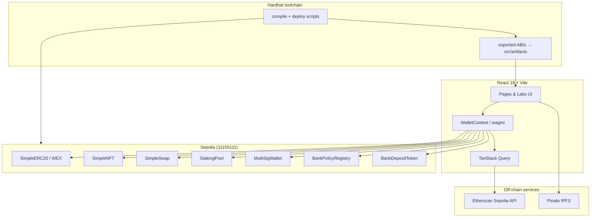
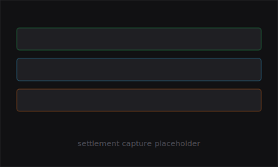
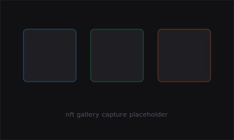

<p align="center">
  
</p>

<p align="center">
  <strong>Terminal-native Web3 dashboard and Sepolia testnet lab.</strong><br/>
  Wallet, swaps, staking, NFT minting, contract deploys, and an institutional settlement pilot — with clear separation between real on-chain flows and educational simulators.
</p>

<p align="center">
  
  
  
  
  
  
  
</p>

<p align="center">
  
  
  
</p>

---


## Quick start

<p align="center">
  
</p>

```bash
npm install
cp .env.example .env
# fill VITE_* keys (see Environment)
npm run compile:contracts
npm run deploy:sepolia   # requires SEPOLIA_RPC_URL + DEPLOYER_PRIVATE_KEY
npm run dev
```

Open `http://localhost:5173`, connect MetaMask on **Sepolia**, and run `npm run check:onchain` to verify contract addresses are wired into the frontend.

---

## Features

| Module | Route | On-chain | Notes |
|--------|-------|:--------:|-------|
| Wallet connect | `/wallet` | ✅ | MetaMask via wagmi/viem |
| Token Generator | `/labs/token-generator` | ✅ | Deploy `SimpleERC20` on Sepolia |
| NFT Gallery | `/nft` | ✅ | Pinata IPFS metadata + `SimpleNFT` mint |
| Contract Playground | `/labs/playground` | ✅ | Deploy Hardhat artifacts from the UI |
| Exchange | `/exchange` | ✅ | `SimpleSwap` ETH ↔ EXC |
| Staking | `/staking` | ✅ | `StakingPool` stake / unstake |
| Multi-Sig Safe | `/labs/multisig` | ✅ | `MultiSigWallet` deploy & propose |
| Institutional Settlement | `/institutional-settlement` | ✅ | `BankPolicyRegistry` + `BankDepositToken` (sandbox demo) |
| DeFi dashboard stats | `/defi` | ⚡ | Real reads when connected |
| Arbitrage lab | `/labs/arbitrage` | 📚 | Educational simulator |
| Bridge portal | `/labs/bridge` | 📚 | Educational simulator |
| Markets / Portfolio charts | `/markets`, `/portfolio` | 🔀 | Mock data + wallet-aware where noted |

**Legend:** ✅ Sepolia contract interaction · ⚡ Live RPC/indexer reads · 📚 Simulator only · 🔀 Mixed mock + wallet data

> **Institutional Settlement** is a testnet sandbox only — no real customer funds, no regulated banking activity. Local demo data powers KYB, alerts, and approvals; on-chain policy enforces allowlist, blocklist, limits, pause, mint, burn, and transfer checks when contracts are deployed.

---

## Architecture



**Data flow:** Vite serves the SPA. wagmi/viem signs transactions through MetaMask. Optional Etherscan and Pinata keys unlock history, gas reads, and NFT metadata uploads. Hardhat compiles Solidity, exports ABIs, and deploys to Sepolia — addresses land in `src/config/deployments.json` and `.env`.

---

## Environment

Copy `.env.example` to `.env` and configure:

| Variable | Required for | Description |
|----------|--------------|-------------|
| `VITE_SEPOLIA_RPC_URL` | Wallet reads | Public Sepolia RPC (default: `https://rpc.sepolia.org`) |
| `VITE_ETHERSCAN_API_KEY` | History, gas, explorer | Etherscan Sepolia API |
| `VITE_PINATA_JWT` | NFT minting | IPFS uploads for token/NFT metadata |
| `VITE_EXC_TOKEN_ADDRESS` | Swap, stake, deploy | Set after deploy (or from `deployments.json`) |
| `VITE_WEX_TOKEN_ADDRESS` | Wrapped EXC flows | Set after deploy |
| `VITE_SIMPLE_NFT_ADDRESS` | NFT Gallery | Set after deploy |
| `VITE_STAKING_POOL_ADDRESS` | Staking | Set after deploy |
| `VITE_SIMPLE_SWAP_ADDRESS` | Exchange | Set after deploy |
| `VITE_BANK_POLICY_REGISTRY_ADDRESS` | Institutional pilot | Set after deploy |
| `VITE_BANK_DEPOSIT_TOKEN_ADDRESS` | Institutional pilot | Set after deploy |
| `SEPOLIA_RPC_URL` | Deploy only | Hardhat deploy RPC (use `contracts/.env` locally) |
| `DEPLOYER_PRIVATE_KEY` | Deploy only | Testnet deployer — **never commit** |

Optional: `VITE_WALLET_CONNECT_PROJECT_ID` for WalletConnect.

---

## Contracts

Compile contracts and export frontend ABIs:

```bash
npm run compile:contracts
```

Check whether the frontend has all required on-chain addresses:

```bash
npm run check:onchain
```

Deploy the Sepolia contracts after setting `SEPOLIA_RPC_URL` and `DEPLOYER_PRIVATE_KEY`:

```bash
npm run deploy:sepolia
```

The deploy script writes `src/config/deployments.json` and prints the `VITE_*` contract addresses to copy into `.env`.

The institutional pilot deploys:

- **`BankPolicyRegistry`** — allowlist, blocklist, account limits, transfer policy checks
- **`BankDepositToken`** — permissioned BDUSD issue, redeem, pause, controlled ERC-20 transfers

Persist these after deployment:

```bash
VITE_BANK_POLICY_REGISTRY_ADDRESS=0x...
VITE_BANK_DEPOSIT_TOKEN_ADDRESS=0x...
```

### Latest Sepolia deployments

Reference snapshot from `src/config/deployments.json` (re-deploy to refresh):

| Contract | Address |
|----------|---------|
| `SimpleERC20` (EXC) | `0xDa25f14fF57b391B927d55484642C83840E3eAAE` |
| `WEXToken` | `0x5053541bB9Ea3c9477346B1d6533Ac2e2B71A3Af` |
| `SimpleNFT` | `0xa2e1E5819D90C1e7DC7dc6e64984AEcb1a06d908` |
| `StakingPool` | `0x1D43F9846DB63557eF860414304E0A892f3B221b` |
| `SimpleSwap` | `0xaA00bA9Eb661e34a9806aD039F6384671A11350b` |
| `BankPolicyRegistry` | `0x7fA538D7b4E5d80fbA155A1e0c0580BFAAd802b4` |
| `BankDepositToken` | `0x524a874f746c8048D0e5EB8D74E8A3095CfF1AC7` |

Network: **Sepolia** · chainId `11155111` · [Etherscan](https://sepolia.etherscan.io/)

---

## Development

```bash
npm run dev          # Vite dev server
npm run lint         # ESLint
npm run build        # Production build
npx hardhat test     # Solidity unit tests
npm run preview      # Preview production build
```

Helper scripts:

```bash
npm run setup:deployer      # Generate a testnet deployer keypair
npm run check:deployer      # Check deployer Sepolia balance
npm run sync:deploy-env     # Sync deploy output into .env
npm run deploy:complete       # Full deploy pipeline
```

---

## Screenshots

> Replace placeholders with captures from your local build (`docs/screenshots/`).

| Dashboard | Exchange | Institutional Settlement |
|:---------:|:--------:|:------------------------:|
|  |  |  |
| *Overview & wallet stats* | *ETH ↔ EXC swap on Sepolia* | *BDUSD policy sandbox* |

| NFT Gallery | Contract Playground |
|:-----------:|:-------------------:|
|  |  |
| *IPFS metadata + mint* | *Artifact deploy from UI* |

<!-- Demo GIF slot: add docs/demo.gif when recorded -->
<!-- <p align="center"></p> -->

---

## Tech stack

| Layer | Tools |
|-------|-------|
| **Frontend** | React 19, Vite 8, React Router 7, Recharts |
| **Web3** | wagmi v2, viem, MetaMask |
| **Contracts** | Hardhat, OpenZeppelin, Solidity 0.8.24 |
| **Storage** | Pinata IPFS (NFT/token metadata) |
| **Indexers** | Etherscan Sepolia API (tx history, gas) |
| **Network** | Ethereum Sepolia testnet |

Product register and design intent: see [`PRODUCT.md`](PRODUCT.md).

---


## Contributing

Issues and PRs welcome. Before submitting:

1. Run `npm run lint` and `npm run build`.
2. For contract changes: `npm run compile:contracts` and `npx hardhat test`.
3. Do not commit `.env`, deployer keys, or API secrets.

## License

Private project (`package.json` → `"private": true`). All rights reserved unless a separate license file is added.

<p align="center">
  <sub>ExChange · Sepolia testnet lab · no mainnet funds · no production banking</sub>
</p>
